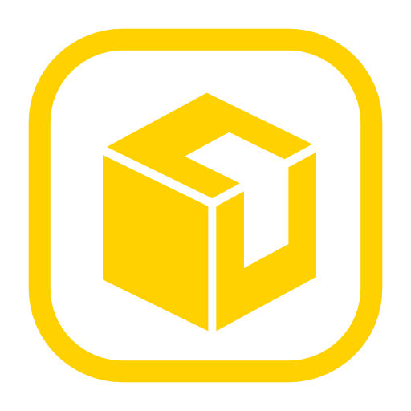

<p align="center">
  
</p>

<h1 align="center">BoxCutter</h1>

<p align="center">
  A Roblox Studio plugin that cuts box-shaped holes into Parts non-destructively.
</p>

<p align="center">
  
  
  
  
  
</p>

---

## Quick Demo

<p align="center">
  <video src="assets/boxCutterUsageDemo.mp4" controls width="600"></video>
</p>

## Features

- **Non-destructive cutting** - select the part to cut and press **Set Target**, then select the part(s) to cut with and click **Add Cutters**. The target becomes a cut model and your parts become invisible cutter boxes outlined in red.
- **Live editing** - move, rotate, or resize cutter boxes with the standard Studio tools; the cut geometry regenerates in real time while the widget is open.
- **Multiple cutters** - adopt as many cutter parts per model as you want, before or after the first cut; delete a cutter to remove its cut.
- **Bake** - strips cutters and plugin data, leaving plain geometry; optionally unions the result into a single UnionOperation.
- **Undo support** - every change is recorded with `ChangeHistoryService`, so undo always restores a consistent state. A whole drag session coalesces into a single waypoint (or folds into Studio's own move gesture, so undoing the cutter move restores the cut in the same step) to keep the history clean.
- **Native Studio look** - the widget UI is built with Fusion and themed Studio components.

## Installation

1. Build the plugin with [Rojo](https://rojo.space):
   ```
   rojo build build.project.json -o BoxCutter.rbxm
   ```
2. Place the output file in your Roblox Studio **Plugins** folder.

## Usage

1. Open the **Box Cutter** widget from the toolbar.
2. Place a block Part where you want the hole, overlapping the part you want to cut.
3. Select the part to cut and press **Set Target** - the target stays set for the session, so you don't need to keep it selected.
4. Select the cutter part(s) and click **Add Cutters** - the target becomes a cut model and your parts become red-outlined cutters.
5. Move/rotate/resize the cutters with the standard Studio tools; the hole follows live. Clicking the cut geometry selects the whole cut model - the generated fragments are rebuilt on every change, so they can't be edited individually.
6. To add more holes later, select the cut model (or any of its cutters or geometry), press **Set Target**, then select new parts and press **Add Cutters** again.
7. When you're happy, click **Bake Selection** to strip the plugin data (optionally unioning the result).

## Development

Tooling is managed with [Rokit](https://github.com/rojo-rbx/rokit):

```
rokit install
cd src && wally install && cd ..
rojo sourcemap build.project.json -o sourcemap.json
wally-package-types --sourcemap sourcemap.json src/Packages
```

`watch-build.ps1` rebuilds the plugin into your local Studio plugins folder whenever a source file changes.

## Tech Stack

- [Fusion 0.2](https://elttob.uk/Fusion/) - reactive UI framework
- [Promise](https://eryn.io/roblox-lua-promise/) - async utilities
- [Janitor](https://github.com/howmanysmall/Janitor) - cleanup management

## License

This project is licensed under the [MIT License](LICENSE).
